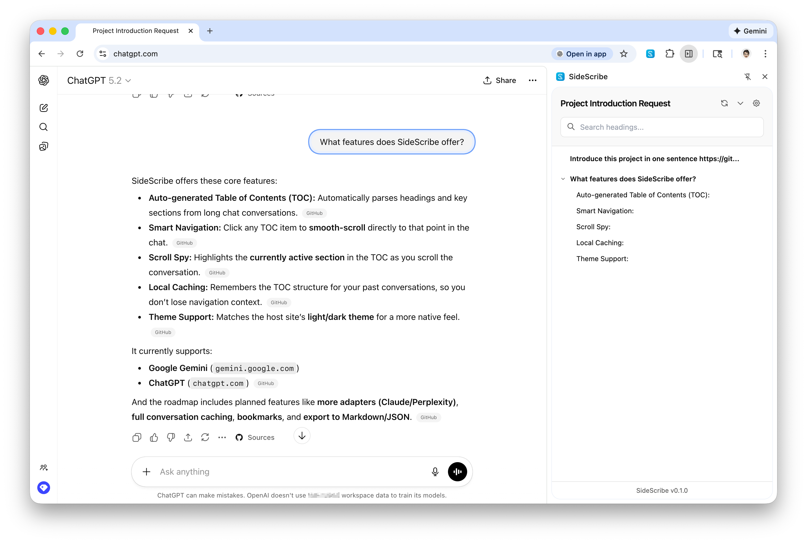
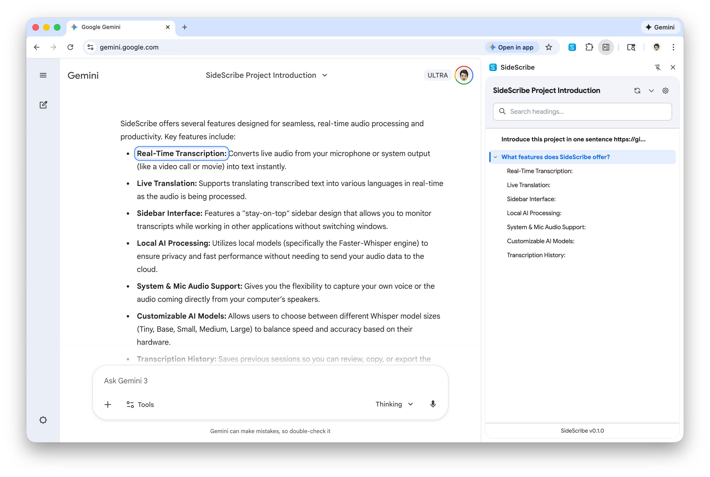

<div align="center">
  
</div>

<h1 align="center">SideScribe</h1>

<p align="center">AI Chat Table of Contents</p>

**SideScribe** is a Chrome Extension that generates a dynamic Table of Contents (TOC) for AI chat interfaces like Google Gemini and ChatGPT. It uses the Chrome Side Panel API to provide seamless navigation through long conversations without cluttering the main interface.

<div align="center">
  
  
</div>

## Features

- 📑 **Auto-generated TOC**: Automatically parses headings and key sections from chat conversations.
- 🎯 **Smart Navigation**: Click any item to smooth-scroll to that position in the chat.
- 🕵️ **Scroll Spy**: Automatically highlights the active section in the TOC as you scroll.
- 💾 **Local Caching**: Remembers the TOC structure of your past conversations.
- 🌓 **Theme Support**: Seamlessly matches the host site’s Light/Dark theme for a native-feeling experience.

## Supported Websites

- [x] **Google Gemini** (`gemini.google.com`)
- [x] **ChatGPT** (`chatgpt.com`)

## Installation

You can download the latest **`.crx`** or **`.zip`** from the [**Releases**](https://github.com/Xicrosoft/SideScribe/releases) page. 

### Install from `.zip` (unpacked)
1. Download the `.zip` file from Releases and unzip it.
2. Open `chrome://extensions` in Chrome.
3. Enable **Developer mode**.
4. Click **Load unpacked** and select the unzipped folder.

### From Source

1.  **Clone the repository**:
    ```bash
    git clone https://github.com/Xicrosoft/SideScribe.git
    cd SideScribe
    ```

2.  **Install dependencies**:
    ```bash
    pnpm install
    # or npm install
    ```

3.  **Build the extension**:
    ```bash
    pnpm build
    ```

4.  **Load in Chrome**:
    - Open `chrome://extensions/`
    - Enable "Developer mode" (top right).
    - Click "Load unpacked".
    - Select the `build/chrome-mv3-prod` directory.

## Usage

1.  Open a supported chat website (e.g., Gemini).
2.  Click the SideScribe extension icon in the toolbar to open the Side Panel.
3.  The Table of Contents will appear automatically.
4.  Navigate through your conversation!

## Roadmap

- [ ] **More Adapters**: Support for Claude, Perplexity, and other AI chat interfaces.
- [ ] **Full Conversation Caching**: Save the complete text of conversations for offline viewing.
- [ ] **Bookmarks**: Ability to "Star" or bookmark specific conversations for quick access.
- [ ] **Export**: Export conversations to Markdown or JSON formats.

## Development

See [CONTRIBUTING.md](CONTRIBUTING.md) for development instructions.

## License

MIT License. See [LICENSE](LICENSE) for more information.
